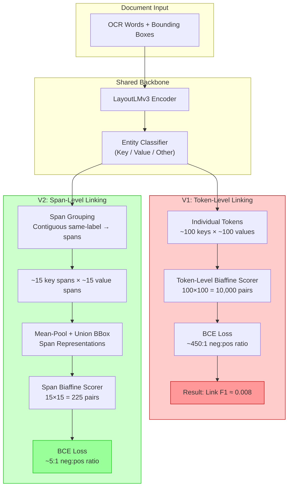
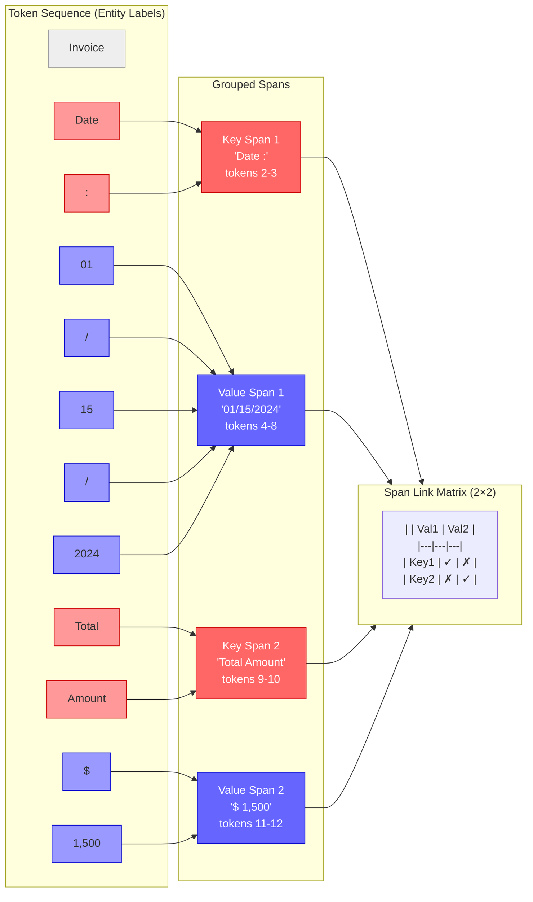

# V2 Architecture & Span Grouping Diagrams

These Mermaid diagrams can be rendered with any Mermaid-compatible tool
(VS Code preview, GitHub, mermaid-cli → PNG/SVG/PDF).

---

## Diagram 1: V1 vs V2 Architecture Comparison

---

## Diagram 2: Span Grouping Detail

---

## Diagram 3: End-to-End Pipeline

```mermaid
flowchart LR
    A["Raw Document<br/>(PDF/Image)"] --> B["OCR<br/>(Tesseract)"]
    B --> C["LMDX Text Format<br/>(words + bboxes)"]
    C --> D["LayoutLMv3<br/>Encoder"]
    D --> E["Entity Classifier<br/>(Key/Value/Other)"]
    E --> F["Span Grouper<br/>(contiguous merge)"]
    F --> G["Biaffine Linker<br/>(span-level)"]
    G --> H["KVP Pairs<br/>(key_text → value_text)"]

    style D fill:#e6f3ff,stroke:#0066cc
    style E fill:#fff3e6,stroke:#cc6600
    style F fill:#e6ffe6,stroke:#00cc00
    style G fill:#ffe6e6,stroke:#cc0000
```

